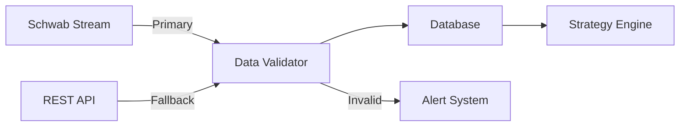
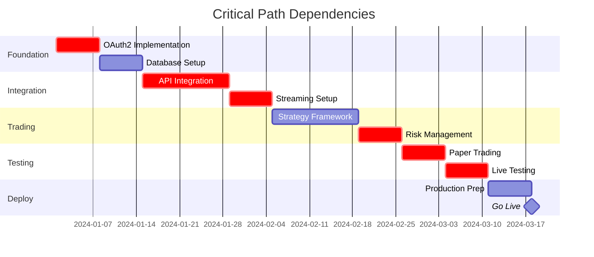

# Critical Dependencies & Decision Points

## Overview

This document identifies critical dependencies, decision points, and potential blockers in the Charles Schwab automated trading system implementation. Understanding these dependencies is crucial for project success and risk management.

## Critical External Dependencies

### 1. Schwab API & schwab-py Library

**Dependency Level**: 🔴 CRITICAL

#### Current State
- **Library**: schwab-py (unofficial Python wrapper)
- **Version**: Check latest on PyPI
- **Maintainer**: alexgolec (individual maintainer)
- **License**: MIT

#### Risks & Mitigations

| Risk | Impact | Probability | Mitigation |
|------|--------|-------------|------------|
| Library abandonment | System failure | Medium | Fork and maintain internally |
| API breaking changes | Integration failure | High | API abstraction layer |
| Rate limit changes | Trading disruption | Medium | Configurable rate limiting |
| API deprecation | Complete failure | Low | Monitor Schwab communications |

#### Action Items
```python
# Create API abstraction layer
from abc import ABC, abstractmethod

class BrokerInterface(ABC):
    @abstractmethod
    async def get_quote(self, symbol: str) -> dict:
        pass
    
    @abstractmethod
    async def place_order(self, order: dict) -> str:
        pass

class SchwabBroker(BrokerInterface):
    """Schwab implementation"""
    pass

class BackupBroker(BrokerInterface):
    """Fallback broker implementation"""
    pass
```

#### Contingency Plan
1. **Primary**: Maintain internal fork of schwab-py
2. **Secondary**: Direct API implementation
3. **Tertiary**: Alternative broker integration (Interactive Brokers, Alpaca)

### 2. OAuth2 Token Management

**Dependency Level**: 🔴 CRITICAL

#### Token Lifecycle
- **Access Token**: 30 minutes
- **Refresh Token**: 7 days
- **Manual Intervention**: Required if refresh fails

#### Critical Decision Points

1. **Token Storage Method**:
   ```python
   # Option A: Encrypted file storage
   # Pros: Simple, portable
   # Cons: Less secure
   
   # Option B: System keyring
   # Pros: More secure, OS-integrated
   # Cons: Platform-specific
   
   # Option C: External vault (HashiCorp Vault)
   # Pros: Most secure, centralized
   # Cons: Complex, additional dependency
   
   # Recommendation: Option B with Option A fallback
   ```

2. **Refresh Strategy**:
   - Refresh at 80% of lifetime (5.6 days)
   - Multiple retry attempts with exponential backoff
   - Alert on refresh failure
   - Manual fallback procedure

### 3. Market Data Quality

**Dependency Level**: 🟡 HIGH

#### Data Pipeline Dependencies



#### Quality Checks
```python
class DataValidator:
    def validate_candle(self, candle: dict) -> bool:
        """Validate OHLCV data"""
        # Price sanity checks
        if candle['high'] < candle['low']:
            return False
        if candle['open'] > candle['high'] or candle['open'] < candle['low']:
            return False
        if candle['close'] > candle['high'] or candle['close'] < candle['low']:
            return False
        
        # Volume check
        if candle['volume'] < 0:
            return False
        
        # Timestamp check
        if not self._is_valid_market_time(candle['timestamp']):
            return False
        
        return True
```

## Technology Stack Dependencies

### 1. Database Selection

**Decision Point**: SQLite vs PostgreSQL

| Criteria | SQLite | PostgreSQL |
|----------|--------|------------|
| Performance | Good for <100k records | Excellent at scale |
| Concurrent writes | Limited | Excellent |
| Replication | Manual | Built-in |
| Time-series | Basic | TimescaleDB extension |
| Deployment | Single file | Server required |

**Recommendation**: 
- Development: SQLite
- Production: PostgreSQL with TimescaleDB

### 2. GUI Framework

**Decision Point**: PyQt6 vs Tkinter vs Web-based

| Criteria | PyQt6 | Tkinter | Web (Dash/Flask) |
|----------|-------|---------|------------------|
| Performance | Excellent | Good | Moderate |
| Look & Feel | Native | Basic | Modern |
| Charts | PyQtGraph | Limited | Plotly |
| Deployment | Desktop only | Desktop only | Any browser |
| Learning curve | Steep | Moderate | Moderate |

**Recommendation**: PyQt6 for desktop power users

### 3. Async Framework

**Decision Point**: asyncio vs threading vs multiprocessing

```python
# Recommended architecture
import asyncio
from concurrent.futures import ProcessPoolExecutor

class TradingEngine:
    def __init__(self):
        # Main event loop for I/O
        self.loop = asyncio.get_event_loop()
        
        # Process pool for CPU-intensive tasks
        self.executor = ProcessPoolExecutor(max_workers=4)
    
    async def run(self):
        # I/O bound - use asyncio
        await asyncio.gather(
            self.stream_manager.start(),
            self.api_manager.start(),
            self.gui_updater.start()
        )
    
    async def optimize_strategy(self, data):
        # CPU bound - use process pool
        result = await self.loop.run_in_executor(
            self.executor,
            self._heavy_computation,
            data
        )
        return result
```

## Critical Decision Points

### 1. Testing Strategy Without Paper Trading

**Challenge**: Schwab doesn't support paper trading

**Options Evaluated**:

1. **Build Complete Simulator**
   - Pros: Full control, realistic scenarios
   - Cons: Complex, time-consuming
   - Effort: 2-3 weeks

2. **Minimal Viable Simulator**
   - Pros: Faster to build, adequate for testing
   - Cons: Less realistic
   - Effort: 1 week

3. **Live Testing with Minimal Capital**
   - Pros: Real-world validation
   - Cons: Financial risk
   - Risk: ~$100-500

**Recommended Approach**:
```python
# Hybrid approach
class TestingStrategy:
    def __init__(self):
        self.phases = [
            # Phase 1: Unit tests with mocked data
            "unit_tests",
            
            # Phase 2: Integration tests with recorded data
            "replay_tests", 
            
            # Phase 3: Minimal simulator
            "paper_trading",
            
            # Phase 4: Live with $100
            "minimal_live",
            
            # Phase 5: Gradual scaling
            "production"
        ]
```

### 2. Strategy Architecture

**Decision**: Monolithic vs Microservices vs Modular Monolith

**Chosen**: Modular Monolith

```python
# Modular monolith structure
trading_system/
├── core/
│   ├── __init__.py
│   ├── interfaces.py      # Abstract interfaces
│   └── events.py          # Event system
├── modules/
│   ├── auth/             # Authentication module
│   ├── broker/           # Broker integration
│   ├── data/             # Data management
│   ├── strategy/         # Trading strategies
│   ├── risk/             # Risk management
│   └── gui/              # User interface
└── main.py               # Application entry point
```

**Rationale**:
- Easier deployment than microservices
- Better modularity than monolithic
- Can evolve to microservices if needed

### 3. Real-time Processing Architecture

**Decision**: Event-driven vs Polling

**Chosen**: Event-driven with fallback polling

```python
class EventDrivenArchitecture:
    def __init__(self):
        self.event_bus = EventBus()
        self.fallback_poller = FallbackPoller()
    
    async def start(self):
        # Primary: WebSocket events
        self.stream_client.on_message = self.handle_stream_event
        
        # Fallback: Polling
        asyncio.create_task(self.fallback_poller.start())
    
    async def handle_stream_event(self, event):
        # Process streaming data
        await self.event_bus.publish('market_data', event)
    
    # Fallback polling every 5 seconds
    async def poll_fallback(self):
        while True:
            if not self.stream_client.is_connected:
                data = await self.fetch_rest_data()
                await self.event_bus.publish('market_data', data)
            await asyncio.sleep(5)
```

## Dependency Management

### 1. Version Pinning Strategy

```python
# requirements.txt
# Critical dependencies - exact versions
schwab-py==0.1.0
sqlalchemy==2.0.23
pyqt6==6.5.0

# Less critical - compatible versions
pandas~=2.1.0
numpy~=1.25.0
pytest>=7.4.0

# Development only
black==23.11.0
mypy==1.7.0
```

### 2. Dependency Monitoring

```yaml
# .github/workflows/dependency-check.yml
name: Dependency Security Check
on:
  schedule:
    - cron: '0 0 * * 0'  # Weekly
  push:
    paths:
      - 'requirements*.txt'

jobs:
  security:
    runs-on: ubuntu-latest
    steps:
      - uses: actions/checkout@v3
      - name: Run Safety Check
        run: |
          pip install safety
          safety check --file requirements.txt
```

### 3. Fallback Libraries

| Primary | Fallback | Purpose |
|---------|----------|---------|
| schwab-py | Direct API | Broker integration |
| PyQt6 | Dash | GUI framework |
| PostgreSQL | SQLite | Database |
| Redis | In-memory dict | Caching |
| Prometheus | Custom metrics | Monitoring |

## Infrastructure Dependencies

### 1. Development Environment

**Minimum Requirements**:
- Python 3.10+
- 8GB RAM
- 50GB disk space
- Stable internet (for streaming)

**Recommended**:
- Python 3.11
- 16GB RAM
- 100GB SSD
- Redundant internet connection

### 2. Production Environment

```yaml
# Production requirements
compute:
  cpu: 4 cores
  ram: 16GB
  disk: 200GB SSD
  
network:
  bandwidth: 100Mbps
  latency: <50ms to Schwab servers
  redundancy: Required
  
availability:
  uptime: 99.5%
  backup: Daily
  recovery: <1 hour
```

### 3. External Services

| Service | Purpose | Criticality | Alternative |
|---------|---------|-------------|-------------|
| Schwab API | Trading | Critical | None |
| NTP Server | Time sync | Critical | Multiple servers |
| DNS | Resolution | High | 8.8.8.8, 1.1.1.1 |
| Email | Alerts | Medium | SMS |
| Monitoring | Observability | Medium | Local logs |

## Go/No-Go Decision Criteria

### Phase 1 Checkpoint (Week 2)
- [ ] OAuth2 authentication working
- [ ] Database schema implemented
- [ ] Basic logging configured
- [ ] CI/CD pipeline running

**No-Go Triggers**:
- Cannot obtain Schwab API access
- OAuth2 refresh mechanism fails
- Core team member unavailable

### Phase 2 Checkpoint (Week 4)
- [ ] Real-time streaming functional
- [ ] Data storage working
- [ ] Basic API operations tested
- [ ] Historical data backfill complete

**No-Go Triggers**:
- Streaming unreliable (>5% data loss)
- API rate limits too restrictive
- Data quality issues

### Phase 3 Checkpoint (Week 6)
- [ ] One strategy fully implemented
- [ ] Backtesting showing positive results
- [ ] Risk controls operational
- [ ] Paper trading simulator ready

**No-Go Triggers**:
- Strategy unprofitable in backtest
- Risk controls failing tests
- Performance issues

### Production Go-Live Criteria
- [ ] All tests passing (>80% coverage)
- [ ] 2 weeks successful paper trading
- [ ] Security audit completed
- [ ] Monitoring operational
- [ ] Disaster recovery tested
- [ ] Team trained
- [ ] $1000 risk capital allocated

## Vendor Lock-in Analysis

### Current Lock-ins

1. **Schwab API**
   - **Lock-in Level**: High
   - **Migration Effort**: 2-3 months
   - **Alternative**: Interactive Brokers, Alpaca

2. **Python Ecosystem**
   - **Lock-in Level**: Medium
   - **Migration Effort**: 6+ months
   - **Alternative**: Java, C++

3. **PyQt GUI**
   - **Lock-in Level**: Low
   - **Migration Effort**: 1 month
   - **Alternative**: Web-based UI

### Migration Strategies

```python
# Broker abstraction for future migration
class BrokerFactory:
    @staticmethod
    def create_broker(broker_type: str) -> BrokerInterface:
        brokers = {
            'schwab': SchwabBroker,
            'ibkr': InteractiveBrokersBroker,
            'alpaca': AlpacaBroker,
            'paper': PaperTradingBroker
        }
        return brokers[broker_type]()
```

## Critical Path Timeline



## Risk Register

| Risk | Impact | Probability | Mitigation | Owner |
|------|--------|-------------|------------|-------|
| schwab-py breaks | Critical | Medium | Fork library | Tech Lead |
| OAuth token expiry | High | Certain | Auto-refresh | DevOps |
| No paper trading | High | Certain | Build simulator | Dev Team |
| API rate limits | Medium | High | Rate limiter | Backend Dev |
| Data quality | High | Medium | Validation layer | Data Engineer |
| Strategy failure | High | Medium | Multiple strategies | Quant |
| Security breach | Critical | Low | Security audit | Security |
| Regulatory issue | Critical | Low | Compliance review | Legal |

## Summary

This document identifies the critical dependencies and decision points for the automated trading system. Regular review and updates of these dependencies are essential for project success. The modular architecture and abstraction layers provide flexibility to adapt to changing requirements or vendor issues.